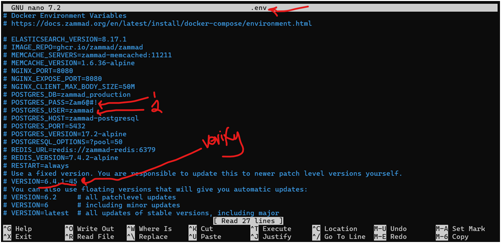
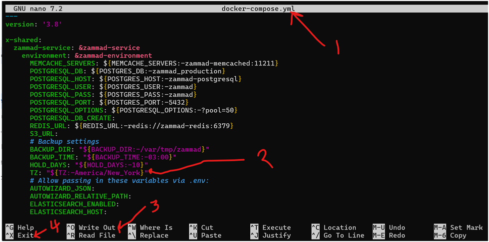
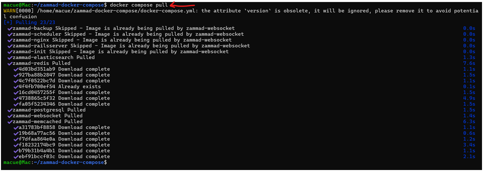
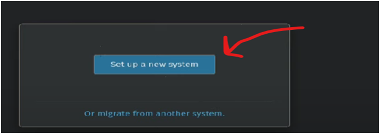
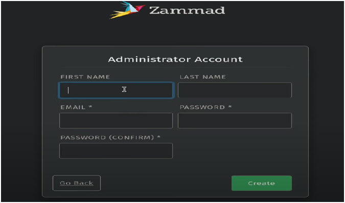
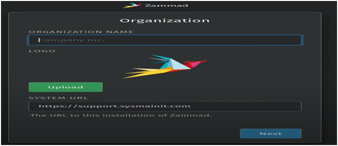
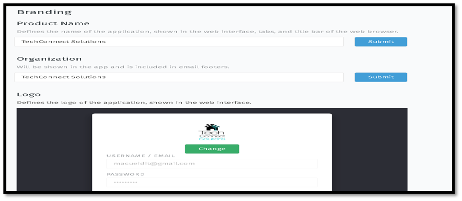
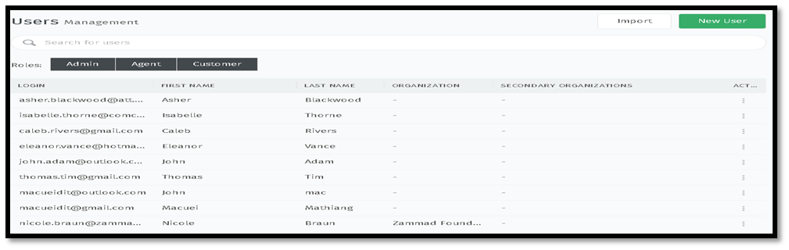
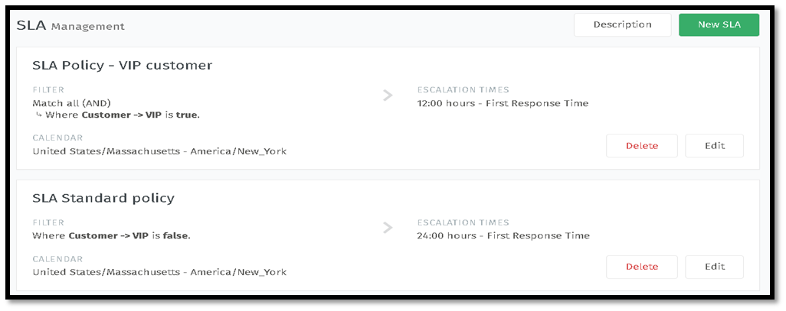

# TechConnect Solutions for Helpdesk


## Description
TechConnect Solutions functions as a centralized help desk system designed for the comprehensive tracking of customer incidents. It facilitates multi-channel ticket submission, encompassing web-based interfaces, electronic mail, and an artificial intelligence chatbot. In addition to standard support functionalities, the system prioritizes expedited response times for VIP clientele. This platform represents a customized implementation of the Zammad ticketing system, augmented with professional branding enhancements. User access control is provisioned to align with the authorized capabilities and rights of each user, including administrators, agents, and customers.


## Table of Contents

- [TechConnect Solutions for Helpdesk](#techconnect-solutions-for-helpdesk)
  - [Description](#description)
  - [Table of Contents](#table-of-contents)
  - [Core features](#core-features)
  - [Installation](#installation)
  - [Documentation of the project implementation](#documentation-of-the-project-implementation)
  - [Acknowledgments](#acknowledgments)

## Core features

1. Multi-channel communication support (email, phone, web, & SMS)
2. Ticket Management
3. Knowledge base capability
4. Full-text search 
5. Allow automation and customization 


## Installation

1. Download and install Docker Desktop
   https://docs.docker.com/desktop/setup/install/windows-install/

2. Install and update Windows Subsystem for Linux (WSL2) - Ubuntu distribution
* Run PowerShell in adminstrator mode:
```markdown
  wsl --install
```
* Update wsl2 
```markdown
wsl --update 
```
* Install required packages - use sudo/root account to install
  
```markdown
  sudo apt install git wget curl -y
```

## Documentation of the project implementation
* Clone the rquired Zammand-docker-compose images
  1. Create a new project directory 
```markdown
  $ mkdir projects

  $ cd projects
```
   
  2. Clone the Zammand-docker-compose for the github.com
```markdown
  $ git clone git@github.com:zammad/zammad-docker-compose.git
```
  3. Change directory to the installed zammand-docker-compose folder
```markdown
  $ cd zammad-docker-compose
```
  4. Create a backup copy of the .env.dist file and edit
```markdown
  $ ls -al  # list all files and folders within the current directory

  $ cp .env.dist .env   # Create a copy of the environment file
```


5. Modify the zammand credentials (username & password) to strong ones
 

6. Change the Time Zone filed inside the docker-compose.yml file to match your time zone
  

7. Pull the related docker images to Zammand applicaiton
    ```markdown
      $ docker compose Pull
    ```

    
    
8. Run Zammand application in background or in deamon mode
    ```markdown
      $ docker compose up -d
    ```
9. Wait for few minutes for your Zammand application provision and visit http://localhost:8080
   


10. Start setting up your new system by following the wizard prompts or migrate from another helpdesk support system.


11. Setup administrator account by filling the following fields



12. Fill in required fields, organization name, upload your company log, URL, and click next.
    
  
13. Communication channels (web, email & chat ) configuration 
    
  a. Web configuration

  b. Email configuration

  c. Chat configuration


14. Branding Configuration: adding custom company name and upload log
    

  

15. User Management: add 2 administrators, 3 agents, and 5 customers.


16.  Service Level Agreements (SLAs): configure standard users to 24-hours and VIP customers to 12-hours response time.
17.  



## Acknowledgments

* Author: Macuei Mathiang 
* This project was a part of the MA workforce IT Development training Projects.
* Date 02/20/2025


