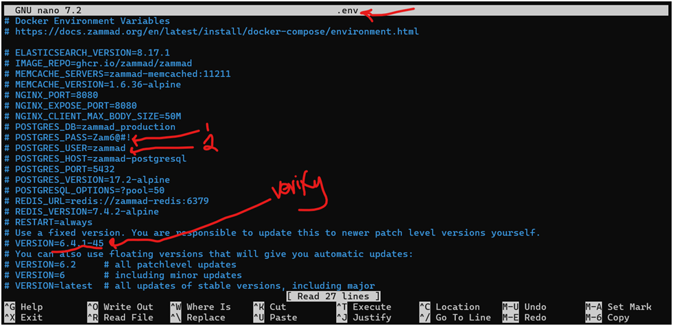
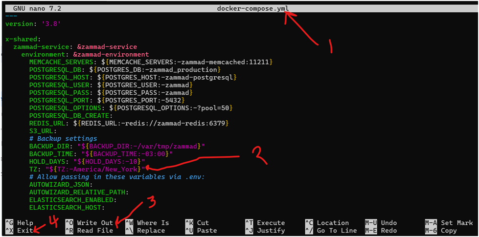
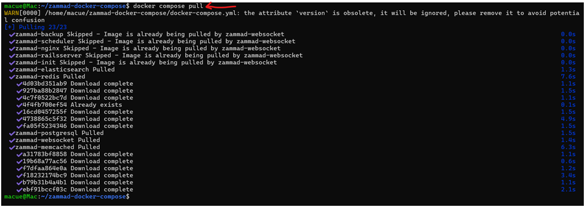
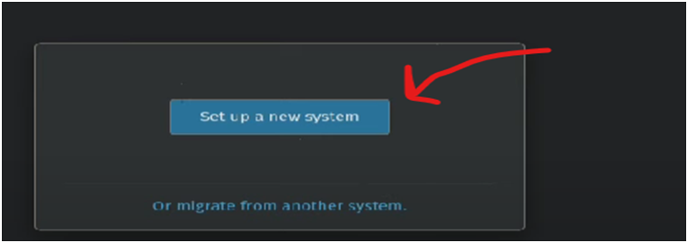
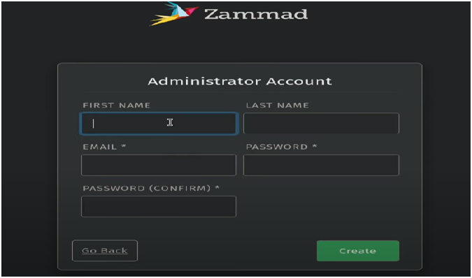
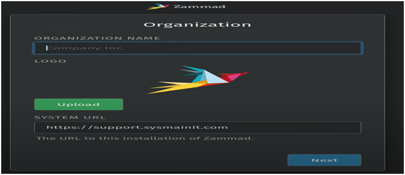
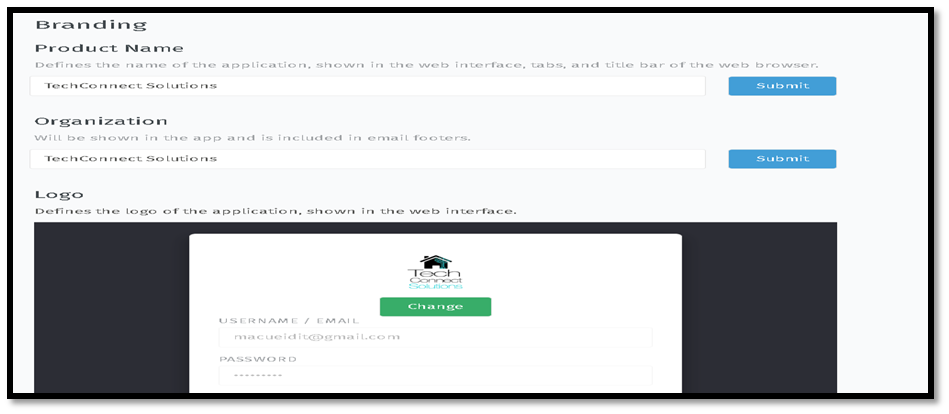
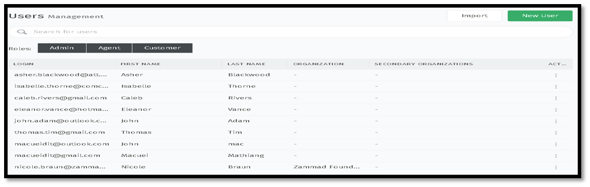
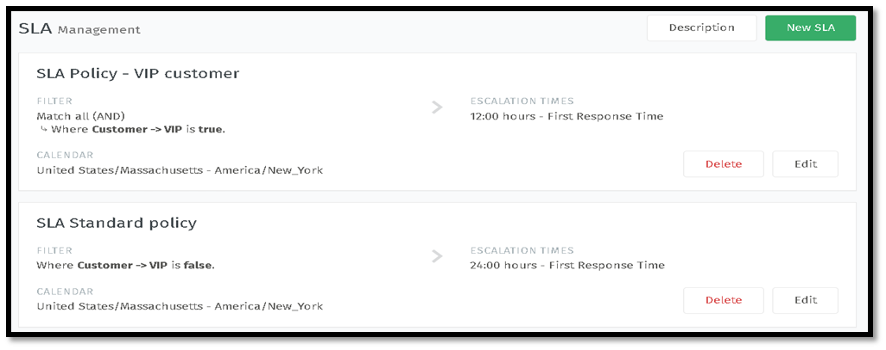

# TechConnect Solutions for Helpdesk


## Description

TechConnect Solutions functions as a centralized help desk system designed for the comprehensive tracking of customer incidents. It facilitates multi-channel ticket submission, encompassing web-based interfaces, electronic mail, and an artificial intelligence chatbot. In addition to standard support functionalities, the system prioritizes expedited response times for VIP clientele. This platform represents a customized implementation of the Zammad ticketing system, augmented with professional branding enhancements. User access control is provisioned to align with the authorized capabilities and rights of each user, including administrators, agents, and customers.

## Table of Contents

- [Description](#description)
- [Core Features](#core-features)
- [Installation](#installation)
- [Documentation of the Project Implementation](#documentation-of-the-project-implementation)
- [Acknowledgments](#acknowledgments)

## Core Features

1. Multi-channel communication support (email, phone, web, & SMS)
2. Ticket Management
3. Knowledge base capability
4. Full-text search
5. Allow automation and customization

## Installation

1. **Download and install Docker Desktop**  
   [Docker Desktop for Windows Installation Guide](https://docs.docker.com/desktop/setup/install/windows-install/)

2. **Install and update Windows Subsystem for Linux (WSL2) - Ubuntu distribution**
    * Run PowerShell in administrator mode:
      ```powershell
      wsl --install
      ```
    * Update WSL2:
      ```powershell
      wsl --update
      ```
    * Install required packages - use sudo/root account to install:
      ```bash
      sudo apt install git wget curl -y
      ```

## Documentation of the Project Implementation

### Setting up the Environment

1. **Create a new project directory**
   ```bash
   mkdir projects
   cd projects
   ```

2. **Clone the Zammad-docker-compose from GitHub**
   ```bash
   git clone git@github.com:zammad/zammad-docker-compose.git
   ```

3. **Navigate to the installed directory**
   ```bash
   cd zammad-docker-compose
   ```

4. **Create and configure environment file**
   ```bash
   ls -al  # list all files and folders within the current directory
   cp .env.dist .env   # Create a copy of the environment file
   ```
   

5. **Modify Zammad credentials**  
   Update the username & password to strong ones
   

6. **Set correct time zone**  
   Change the Time Zone field inside the docker-compose.yml file to match your time zone
   

7. **Pull Docker images**
   ```bash
   docker compose pull
   ```
   

8. **Launch Zammad in background mode**
   ```bash
   docker compose up -d
   ```

9. **Access the application**  
   Wait a few minutes for your Zammad application to provision and visit http://localhost:8080

### Initial System Configuration

10. **Initial Setup**  
    Start setting up your new system by following the wizard prompts or migrate from another helpdesk support system.
    

11. **Administrator Account Setup**  
    Configure the administrator account by filling in the required fields
    

12. **Organization Configuration**  
    Fill in required fields including organization name, upload your company logo, URL, and click next.
    

13. **Communication Channels Configuration**  
    Configure the following communication channels:
    * Web configuration
    * Email configuration
    * Chat configuration

14. **Branding Configuration**  
    Add custom company name and upload logo
    

15. **User Management**  
    Add 2 administrators, 3 agents, and 5 customers.
    

16. **Service Level Agreements (SLAs)**  
    Configure standard users to 24-hours and VIP customers to 12-hours response time.
    

## Acknowledgments

* **Author:** Macuei Mathiang
* This project was part of the MA workforce IT Development training Projects.
* **Date:** 02/20/2025